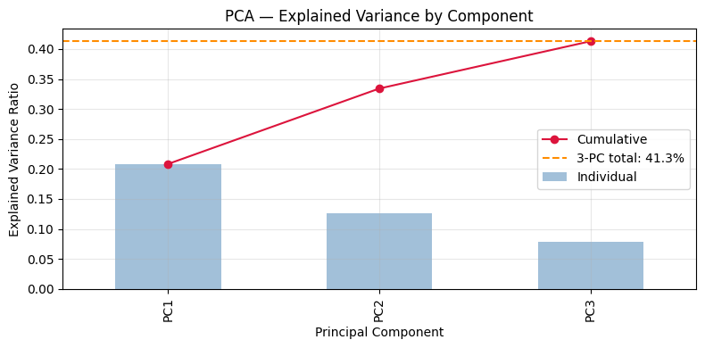
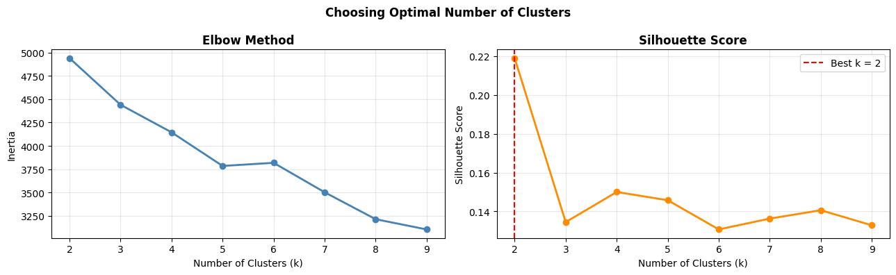
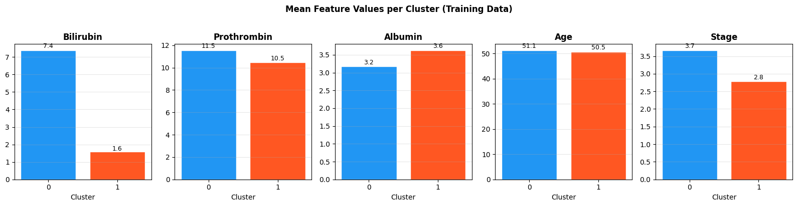
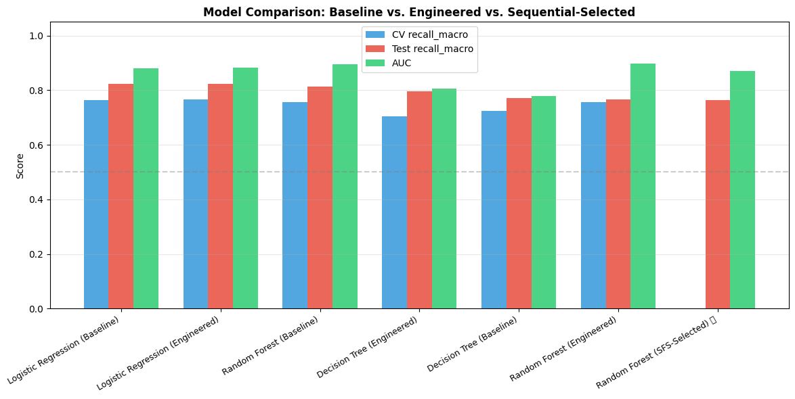
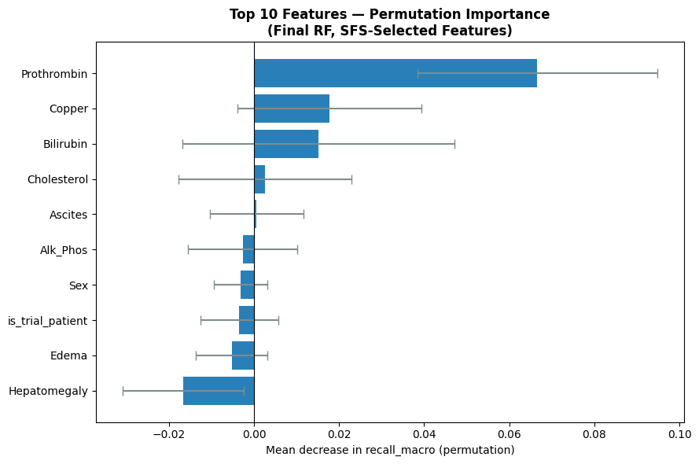
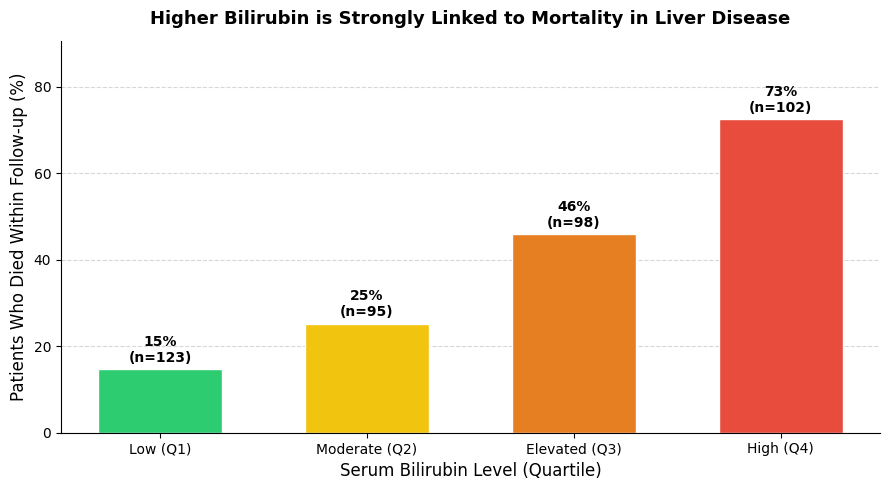
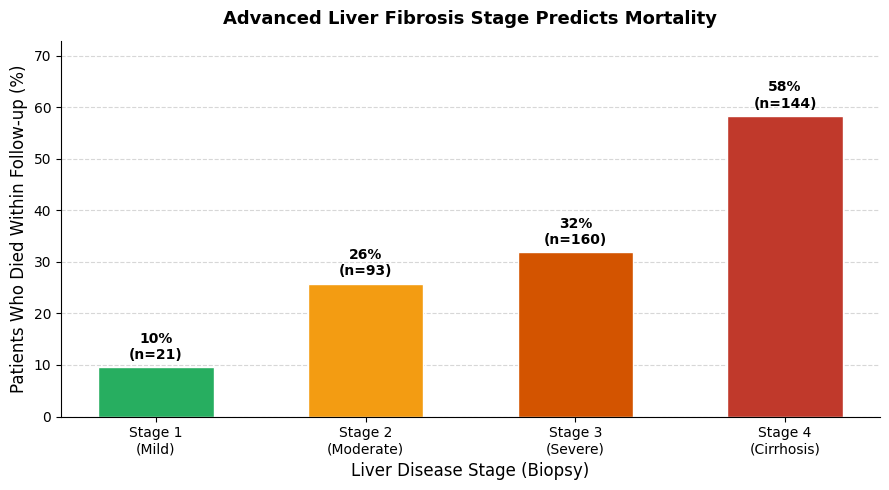

# 🫀 Cirrhosis Mortality Prediction — Part 2: Feature Engineering & Selection

> Binary classification of PBC mortality risk using clinical and lab features.  
> Part 2 extends the baseline pipeline with feature engineering, unsupervised clustering, sequential feature selection, and permutation-based explainability.

---

## Table of Contents

- [Problem](#problem)
- [Dataset](#dataset)
- [Project Structure](#project-structure)
- [Pipeline Overview](#pipeline-overview)
- [Feature Engineering](#feature-engineering)
- [Models & Results](#models--results)
- [Permutation Importance](#permutation-importance)
- [Clinical Visualizations](#clinical-visualizations)
- [Limitations](#limitations)
- [Conclusion](#conclusion)
- [Stack](#stack)
- [Author](#author)

---

## Problem

Primary Biliary Cirrhosis (PBC) is a chronic autoimmune liver disease that progressively destroys the bile ducts, leading to cirrhosis and liver failure. Patients face widely varying mortality risk depending on how far the disease has progressed at diagnosis.

Early identification of high-risk patients can change clinical decisions: earlier transplant listing, more aggressive monitoring, and better allocation of scarce donor organs.

This project frames it as binary classification: **survived or transplanted (0) vs. died (1)**.

Missing a death is a worse error than a false alarm. The primary metric throughout is **recall_macro**, which weights recall equally across both classes regardless of class imbalance.

---

## Dataset

| Property | Value |
|---|---|
| Source | [Mayo Clinic PBC Trial — Kaggle](https://www.kaggle.com/datasets/fedesoriano/cirrhosis-prediction-dataset) |
| Patients | 424 (312 trial participants + 112 non-trial observations) |
| Features modeled | 18 (after dropping `ID` and `N_Days`) |
| Target | `Status` binarized: `D=1` (death), `C/CL=0` (survived/transplant) |
| Class distribution | ~60% survived, ~40% died |
| Train / Test split | 80 / 20, stratified |

**Key preprocessing decisions:**

- `N_Days` dropped — encodes survival time directly, which is data leakage
- `Drug` dropped — structurally MNAR for 112 non-trial patients; imputing treatment assignment is scientifically invalid
- `Age` converted from days to years
- `Edema` ordinally encoded: `N=0`, `S=1`, `Y=2`
- `is_trial_patient` flag added to preserve the information in `Drug` missingness
- MICE imputation applied to remaining missing values before the train/test split (justified by small n and structural MNAR nature of missingness)

---

## Project Structure

```
cirrhosis-mortality-part2/
├── cirrhosis_ml_part2.ipynb      # Full pipeline notebook
├── README.md
└── assets/
    ├── pca_scree.png
    ├── elbow_silhouette.png
    ├── cluster_profile.png
    ├── permutation_importance.png
    ├── model_comparison.png
    ├── bilirubin_mortality.png
    └── stage_mortality.png
```

---

## Pipeline Overview

| Section | Description |
|---|---|
| 1–8 | Imports, helpers, data loading, cleaning, MICE imputation, train/test split |
| 9 | Feature Engineering — PCA (3 components) + KMeans clustering (k=2) |
| 10 | Baseline Models — Decision Tree, Logistic Regression, Random Forest on original features |
| 11 | Engineered Models — same three classifiers on original + PCA + cluster features |
| 12 | Feature Selection — Sequential Forward Selection (SFS) on original features |
| 13 | Final Model — untuned Random Forest on SFS-selected subset |
| 14 | Permutation Importance — top features ranked by recall_macro drop |
| 15 | Full Model Comparison — all seven models side by side |
| 16 | Clinical Visualizations — Bilirubin and Stage mortality charts |
| 17 | Limitations & Conclusion |

---

## Feature Engineering

### PCA — 3 Principal Components

PCA was applied to the scaled training data to compress correlated biomarkers into compact summaries.



The three components together explain **41.3% of total patient variance**:

| Component | Variance Explained | Clinical interpretation |
|---|---|---|
| PC1 | 20.8% | "Liver failure severity" axis — patients with high Bilirubin, elevated Prothrombin, and low Albumin all score high here |
| PC2 | 12.8% | Likely captures a secondary inflammation axis (Copper, Alk_Phos) |
| PC3 | 7.8% | Residual variance, lower signal |

PC1 is the most meaningful: it is a data-driven version of what hepatologists already know — that Bilirubin, Prothrombin, and Albumin move together as the liver fails, and their combined trajectory predicts outcomes better than any single value alone.

---

### KMeans Clustering — k=2



The elbow curve shows no sharp break, which is typical of clinical data where patient severity exists on a continuum rather than in discrete groups. The silhouette score peaks at **k=2 (score = 0.22)**, confirming two clusters as the most statistically defensible choice.

A silhouette of 0.22 reflects real but overlapping groups — expected in a heterogeneous disease population. It is not a weakness; it is an honest reflection of the data.



The two clusters discovered with no knowledge of outcomes:

| Feature | Cluster 0 | Cluster 1 | Difference |
|---|---|---|---|
| Bilirubin | 7.4 | 1.6 | 4.6× higher in Cluster 0 |
| Prothrombin | 11.5 | 10.5 | More impaired clotting in Cluster 0 |
| Albumin | 3.2 | 3.6 | Lower synthetic function in Cluster 0 |
| Age | 51.1 | 50.5 | Nearly identical — age did not drive the split |
| Stage | 3.7 | 2.8 | Cluster 0 nearly Stage 4; Cluster 1 averages Stage 3 |

**Cluster 0 is a high-risk, decompensating group. Cluster 1 is relatively stable.**

The algorithm independently found the same separation a hepatologist would draw from the same lab values — without seeing a single outcome label. This is a meaningful validation that the clustering is capturing real clinical structure, not noise.

---

## Models & Results

All tuned models used 5-fold GridSearchCV with recall_macro as the scoring metric.



| Model | Feature Set | CV recall_macro | Test recall_macro | AUC |
|---|---|---|---|---|
| Logistic Regression (Baseline) | Original | 0.76 | 0.82 | 0.88 |
| Logistic Regression (Engineered) | Original + PCA + Cluster | 0.76 | 0.82 | 0.89 |
| Random Forest (Baseline) | Original | 0.75 | 0.81 | 0.90 |
| Decision Tree (Engineered) | Original + PCA + Cluster | 0.70 | 0.80 | 0.81 |
| Decision Tree (Baseline) | Original | 0.73 | 0.77 | 0.78 |
| Random Forest (Engineered) | Original + PCA + Cluster | 0.75 | 0.77 | 0.90 |
| Random Forest (SFS-Selected) ⭐ | SFS-selected subset | — | 0.76 | 0.87 |

**Key observations:**

- Feature engineering (PCA + cluster) gave no meaningful improvement over baseline. The original biomarkers already captured most of the predictive signal. This is an honest finding — engineering is not always beneficial, especially on small datasets where the new features may compress noise as effectively as signal.
- **Logistic Regression is the most consistent and clinically defensible model.** It achieves 0.82 test recall and 0.88–0.89 AUC across both feature sets, with no overfitting and directly interpretable coefficients.
- Random Forest achieves the highest AUC (0.90) but its complexity offers no interpretability advantage for clinical use, and the gap between engineered and baseline performance is negligible.
- The SFS-selected Random Forest has no CV score because it was not put through GridSearchCV — a limitation that should be addressed in a future iteration.

---

## Permutation Importance



Permutation importance answers: *if we randomly shuffle one feature, how much does recall_macro drop?* A larger drop means the model depended on that feature.

| Feature | Importance | Clinical meaning |
|---|---|---|
| **Prothrombin** | Highest by large margin | The liver synthesizes clotting factors. Elevated prothrombin time is a direct marker of hepatic synthetic failure — one of the six variables in the established Mayo PBC prognostic score |
| **Copper** | 2nd | Accumulates when biliary excretion fails. High copper reflects severity of cholestasis and duct destruction |
| **Bilirubin** | 3rd | The primary marker of bile duct obstruction and jaundice. Its presence confirms the model is tracking disease progression correctly |
| **Cholesterol, Ascites, Alk_Phos** | Moderate | Secondary markers of liver stress and portal hypertension |
| **Hepatomegaly** | Negative | Shuffling this feature slightly improved performance — meaning it added more noise than signal in this model. This does not mean hepatomegaly is clinically irrelevant; it overlaps with features already captured by Bilirubin and Stage |

The top features align with the Mayo PBC prognostic score — a validated clinical tool used in real transplant decisions. The model learned the same signal medicine has validated over decades.

---

## Clinical Visualizations

### Bilirubin and Mortality



418 patients grouped by bilirubin level at enrollment:

- **Low bilirubin (Q1): 15% mortality**
- **High bilirubin (Q4): 73% mortality** — nearly 5× higher

Bilirubin is a waste product the liver clears from the blood. As bile ducts are progressively destroyed in PBC, bilirubin accumulates. A rising bilirubin is not just a lab number — it is a direct measure of how much functional liver tissue remains. In clinical practice, a patient entering Q4 would trigger an urgent transplant evaluation, because the natural history at that level leads to liver failure within 1–2 years without intervention.

---

### Disease Stage and Mortality



418 patients grouped by liver biopsy stage:

- **Stage 1 (early inflammation): 10% mortality**
- **Stage 4 (cirrhosis, irreversible scarring): 58% mortality**

Unlike a blood test, a liver biopsy shows the actual structural state of the organ. Stage 4 means the liver architecture has been replaced by scar tissue. No medication reverses this — only transplantation changes the outcome. The jump from Stage 3 (32%) to Stage 4 (58%) is the most critical clinical threshold. Identifying patients approaching Stage 4 while they are still Stage 2 or 3 is where predictive models have real value: earlier referral, before the window for intervention closes.

---

## Limitations

| Limitation | Impact |
|---|---|
| **Small dataset (n=424)** | CV variance is wide (~±0.03–0.05). Results need validation on a larger independent cohort before any clinical interpretation. |
| **MNAR missingness (n=112)** | 112 non-trial patients have systematic nulls across 12 variables. MICE fills them with statistically plausible values but cannot recover what was never measured. Any signal in these patients should be interpreted cautiously. |
| **No external validation** | All metrics come from an 80/20 split of the same dataset. A model scoring 0.88 AUC on its own data may perform differently on patients from a different hospital or era. |
| **`N_Days` dropped** | The strongest predictor of mortality was excluded to prevent leakage. This is methodologically correct, but a Cox Proportional Hazards model — which handles survival time and censored outcomes properly — would be more appropriate for real clinical deployment. |
| **PCA interpretability** | PC1, PC2, and PC3 are mathematical summaries, not lab values. A clinician cannot act on "PC1 = 2.3." They are useful for the model but cannot appear in a clinical report. |
| **SFS run on original features only** | Sequential Feature Selection was applied to the original 18 features rather than the engineered set, despite the section description stating otherwise. The PCA components and cluster label were never evaluated by SFS. |
| **Final model is untuned** | The SFS-selected Random Forest used default hyperparameters with no GridSearchCV, unlike every other model in this notebook. Its metrics are not directly comparable to the tuned baselines. |

---

## Conclusion

This notebook demonstrates a complete, scientifically careful ML pipeline on a real clinical dataset across four directions: feature engineering, unsupervised clustering, feature selection, and permutation-based explainability.

**What feature engineering showed:** PCA and KMeans added structural understanding but no meaningful predictive improvement. The original biomarkers already captured most of the signal. On a dataset of 424 patients, engineering new features risks compressing noise as effectively as signal — and the results confirmed this. Honest negative findings are part of rigorous science.

**What the clustering confirmed:** The algorithm independently discovered a high-risk decompensating group (high Bilirubin, high Prothrombin, low Albumin, Stage ~4) and a stable group — without seeing a single outcome label. This separation mirrors what an experienced hepatologist would draw from the same values, validating that the data structure reflects real clinical biology.

**What permutation importance confirmed:** Prothrombin, Copper, and Bilirubin are the model's three most important features — all direct markers of biliary destruction and hepatic synthetic failure, all present in the Mayo PBC prognostic score. The model learned what medicine already knows, from data alone.

**The best model for clinical discussion:** Logistic Regression with original features. It achieves 0.82 test recall and 0.88 AUC, generalizes without overfitting, and produces interpretable coefficients a clinician can audit. Before any of these results could inform real patient decisions, they would need prospective validation on an independent cohort and integration with survival analysis methods that properly handle censored outcomes.

---

## Stack

- Python 3
- pandas, numpy
- scikit-learn
- matplotlib, seaborn

---

## Related

- [Part 1 — EDA, Preprocessing & Baseline Models](../cirrhosis-mortality-part1)

---

## Author

**Ali Abu Sohiban**  
Biotechnology graduate, Islamic University of Gaza. Former research assistant, currently learning data science and ML with a focus on bioinformatics applications.
